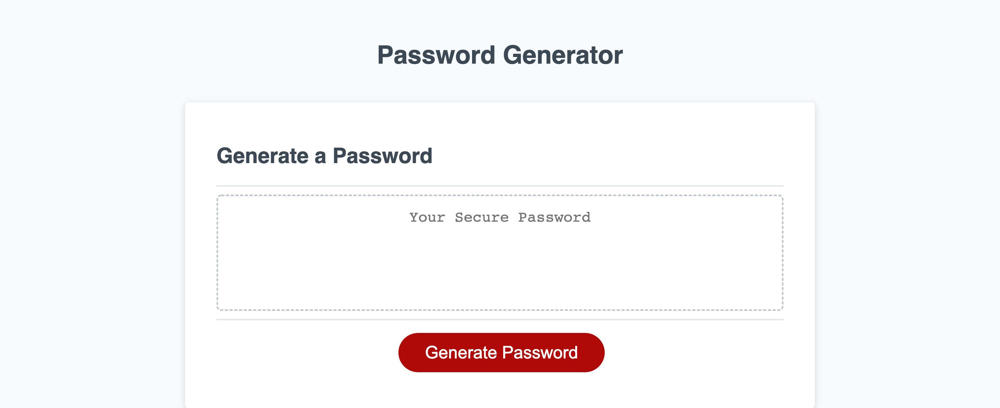

# Password Generator

This week's challenge I had to write the javascript for a random Password Generator. I had to create prompts where the user could select whether they wanted to have an uppercase, lowercase, number and/or a special character. If the user doesn't select a password with 8 to 128 characters, the password won't be generated and user will have to re-do steps.

# Screenshot

# URL for website

[Get your new password today!](https://jblay10.github.io/passwordGenerator/Develop/index.html)